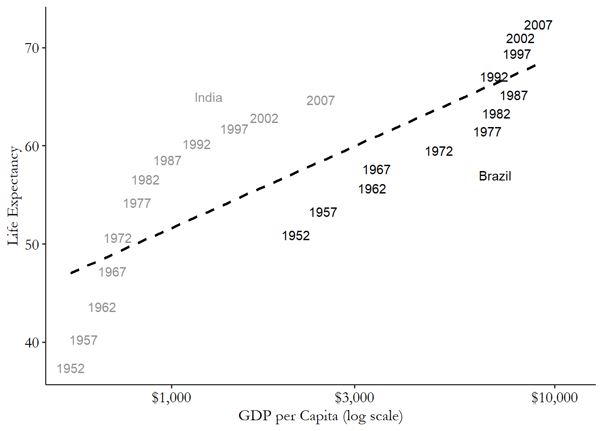

```{r setup, include=FALSE, message = FALSE, warning = FALSE}
knitr::opts_chunk$set(echo = TRUE)

## Packages
library(knitr)
library(tidyverse)
library(plm)
library(readr)
library(readxl)
library(stargazer)

```

# Introduction

```{r, echo=FALSE}

```

## Purpose of This Site

The goal of this site is to have a place where you can look for examples of code. Think of this site as a log of all of the topics we cover in class and in lab sessions. I will make updates throughout the semester as we cover more advanced material. I hope this proves to be a helpful and beneficial resource and offer an easier to access format than the files posted to Canvas. If you are interested, I am happy to add you to the GitHub and you can make some direct edits to add your code!

Let me know if any of this code doesn’t run correctly or if you have any questions or issues!

## Loading Data

The easiest way to load data into R and ensure you have the correct file path is to create a folder on your computer for each assignment and place the datasets directly into that folder.

1. Create a folder on your computer for each new analysis

2. Download your Data and move the file to your newly created folder

3. Then open RStudio

4. Click the project button in the top right corner

5. Click new project

6. Click existing directory

7. Click browse and find the folder that you created

8. Click create project

9. Once your new project opens, click the blank page with a green plus sign icon in the top left corner under the file option

10. Click R script to open a new script

11. You should also be able to see your data file in the bottom right window of RStudio, click the file and follow the options depending on the file type

12. Once your data is imported into R, the code that R automatically ran will be in the console window on the bottom left, copy and paste it to your fresh R script
  - For example, in Lab 1, my code looked like: `read_excel("USstates.xlsx")`

13. Run this copy and pasted line of code whenever you open the R Project and you will never have to worry about complicated file pathing commands

14. I recommend using the assignment operator `<-` to give  your dataset a short and simple name like `df`, `dta`, or, if you are working with multiple datasets, name each something short and descriptive

# Lab I: Tidyverse

```{r, echo=FALSE}
knitr::include_graphics("Images/image_1.png")
```

### Preparation

```{r, eval = FALSE}
## Packages
library(tidyverse)
library(dplyr)
library(readxl) # Package to read Excel data
library(stargazer)

```

## Join the data sets.
- Join the cases and vaccination data by date and state.
    - Case data: [United_States_COVID-19_Cases_and_Deaths_by_State_over_Time.csv](# https://data.cdc.gov/Case-Surveillance/United-States-COVID-19-Cases-and-Deaths-by-State-o/9mfq-cb36)

    - Vaccination data: [COVID-19_Vaccinations_in_the_United_States_Jurisdiction.csv](https://data.cdc.gov/Vaccinations/COVID-19-Vaccinations-in-the-United-States-Jurisdi/unsk-b7fc)

    - Other state variables: USstates.xlsx

- Add the USstates.xlsx data and limit your dataframe to the states listed in USstates.xlsx.  
- How do you know if your merge was successful?

**ANSWER: Looking at the dataframe is useful.  Look at individual states - do the variables that are supposed to be the same (e.g. population) the same over the time period?  Do the case numbers look reasonable?**


```{r}
## Load data 
# https://data.cdc.gov/Case-Surveillance/United-States-COVID-19-Cases-and-Deaths-by-State-o/9mfq-cb36
cases <- read.csv("Data/United_States_COVID-19_Cases_and_Deaths_by_State_over_Time.csv")

# Vax data 
  # "COVID-19 Vaccinations in the United States,Jurisdiction"
  # https://data.cdc.gov/Vaccinations/COVID-19-Vaccinations-in-the-United-States-Jurisdi/unsk-b7fc
vax <- read.csv("Data/COVID-19_Vaccinations_in_the_United_States_Jurisdiction.csv")

df <- cases %>% 
  left_join(vax, by = c("submission_date" = "Date",
                        "state" = "Location"))

# Add state variables
stFacts <- read_excel("Data/USstates.xlsx", sheet = "data") %>% 
  rename(trump2020Pct = trump2020_percent) 
# %>% mutate(trump2020Pct = trump2020Pct)

df <- df %>% 
  filter(state %in% stFacts$stateAbbr == 1) %>%
  left_join(stFacts, by = c("state" = "stateAbbr")) 

```

## Create and add the following four variables to your dataframe:  density (based on *sqMiles* and *pop2019*), deaths per capita (based on *new_death*), cases per capita (based on *new_case*) and vaccinated percent (based on *Series_Complete_12PlusPop_Pct*).

- For a specific day (based on *submission_date*), show the top five states ranked by deaths per capita and calculate the average vaccinated per capita and the mean, minimum and maximum deaths per capita.

```{r}
df <- df %>% 
  mutate("deathsPC" = 100000*new_death/pop2019, 
         "casesPC"  = 100000*new_case/pop2019,
         "vaxedPct"  = Series_Complete_12PlusPop_Pct/100,
         "density"   = pop2019/(1000000*sqMiles))

```

```{r}
# Pick a day
DATE <- "10/18/2021"

df_day <- df %>% 
  filter(submission_date == DATE) %>%
  arrange(desc(deathsPC))

# Look at data (check for negative deaths etc)
df_day %>% 
  dplyr::select(submission_date, state, new_case, new_death, deathsPC, casesPC) %>% 
  slice(1:5)

df_day %>% 
  summarize(meanVaxedPct = mean(vaxedPct),
            meanDeath = mean(deathsPC),
            minDeath = min(deathsPC),
            maxDeath = max(deathsPC))

```

## Estimate three regression models with deaths per capita on your selected day as the dependent variable.
- Your first model will have only Trump 2020 percent as an independent variable.
- Your second model will add vaccinated percent as an independent variable.
- Your third model will add density.
- Before you estimate the models, write down your expectations about what will happen in these models.

**ANSWER: See table below. The key idea here is omitted variable bias.  If we only have Trump percent, then vaccination rates are omitted.  For October 1st, 2021, the Trump variable becomes insignificant when vaccination rates are included.  One complication, for which I suspect there is no clear answer, is whether vaccination rates are a post-treatment variable.  What do you think?**

```{r}
## Models
ols.1 <- lm(deathsPC ~ trump2020Pct, data = df_day)
summary(ols.1)

ols.2 <- lm(deathsPC ~ trump2020Pct + vaxedPct, data = df_day)
summary(ols.2)

ols.3 <- lm(deathsPC ~ trump2020Pct + vaxedPct + density, data = df_day)
summary(ols.3)

```

## Assess specific vaccines
- Create and add vaccinated percent by state for each of the Pfizer, Modern and Janssen (which is Johnson and Johnson) vaccines.
- Use _pop2019_ for population
- Use Series\_Complete\_Moderna\_18Plus, Series\_Complete\_Janssen\_18Plus and Series\_Complete\_Pfizer\_18Plus for the vaccination totals.

- Estimate a model in which deaths per capita is a function of all three vaccination rates.

- Explain what the results mean, especially in light of the results above for overall vaccination results.

- Explain how one would compare the efficacy of the individual vaccines (e.g., whether the Moderna vaccine works better than the Johnson and Johnson vaccine).

**ANSWER: The major issue here is multicollinearity.  For October 1, 2021, the overall vaccination rate was statistically significant (see models 1 - 3 in the table) yet each of the different vaccines was insignificant (see model 4).  The vaccines are multicollinear (which can be assessed with an auxilliary regression) so the loss of power is not terribly surprising.  An F-test whether _all_ the specific vaccine variables equal zero is reported for model 4 and, broadly consistent with the results in models 1 -3 we can say that we can reject the null that all individual vaccines have zero effect.  To assess whether Moderna is better than Johnson and Johnson we would do an F-test where our restricted equation adds those two vaccines.  If doing so causes a substantial reduction in fit we would reject the null that the effects of those two vaccines are equal. (And we would want to take such results with a grain of salt given endogeneity in which states have which vaccines.)**

```{r}
df <- df %>% 
  mutate("vaxedPctModerna"  = Series_Complete_Moderna_18Plus/(100*pop2019),
         "vaxedPctJans"  = Series_Complete_Janssen_18Plus/(100*pop2019),
         "vaxedPctPfizer"  = Series_Complete_Pfizer_18Plus/(100*pop2019))

df_day <- df %>% 
  filter(submission_date == DATE)

ols.4 <- lm(deathsPC ~ vaxedPctJans + vaxedPctModerna +
             vaxedPctPfizer, data = df_day)

summary(ols.4)

```

```{r, results = 'asis', collapse = TRUE}
stargazer(ols.1, ols.2, ols.3, ols.4,
          type = "html", # FOR PDF - the "asis" above makes it work
          keep.stat = c("n","ser", "rsq", "f"),
          report = "vcst",
          column.labels = c("Model 1", "Model 2", "Model 3", "Model 4"),
          digits = 3,
          dep.var.caption = "", dep.var.labels.include = FALSE)
```

# Lab II: Panel Data

```{r, echo=FALSE}

```

### Preparation

```{r, eval = FALSE}
# Load packages used in this session of R
library(knitr)
library(tidyverse)
library(plm)
library(readr)
library(readxl) # Package to read Excel data
opts_chunk$set(echo = TRUE)
options(digits = 2)

```

In this lab we will estimate standard panel data models on covid policy and cases/deaths in U.S. states.  This is not a full-fledged analysis, but rather an initial exploration of the data that illustrates how fixed effects models work.

## Load the data from Oxford_Covid_data_US_latest.csv

Oxford provides data on covid deaths/cases and policy variables by day by state. For more background, see this [data archive](https://www.bsg.ox.ac.uk/research/research-projects/coronavirus-government-response-tracker#data) or this [story](https://www.nytimes.com/interactive/2020/11/18/us/covid-state-restrictions.html) that uses the data. We will use a variable called _GovernmentResponseIndex_.  For details, see [this](https://www.bsg.ox.ac.uk/sites/default/files/2020-08/2020-08-06%20Oxford%20COVID-19%20Government%20Response%20Tracker%20expanded%20to%20US%20states%20PRESS%20RELEASE.pdf).  (And feel free to experiment with the other measures.)
                                                                                                                       ##  Data organization
                                                                                                                      - Load the _Oxford_Covid_data_US_latest.csv_ data
                                                                                                                      - Limit it to U.S. states (CountryName == "United States)
- Create the following variables: RegionName, RegionCode, Date, GovernmentResponseIndex, ConfirmedCases and ConfirmedDeaths
- Add a variable to this data frame using the following code (this variable will help us when merging below)
```{r eval = FALSE}
  mutate("stAbbrev" = str_replace_all(string = RegionCode, pattern = "US_", replacement = "" ))
```

- Show the first three variables of the first three lines of this data frame.
```{r tidy = FALSE}
# Load and filter state stringency data
stPolicy = read_csv("Data/Oxford_Covid_data_US_latest.csv") %>%
  filter(CountryName == "United States" & 
           is.na(RegionName) == 0 & 
           RegionName != "" &
           RegionCode != "US_VI") %>% 
  dplyr::select(RegionName, RegionCode, Date, ContainmentHealthIndex,
         GovernmentResponseIndex, StringencyIndex, 
         ConfirmedCases, ConfirmedDeaths) %>%
  mutate("stAbbrev" = str_replace_all(string = RegionCode, pattern = "US_", replacement = "" ))

# Show the first three variables of first three lines
stPolicy[1:3, 1:3]
```

## Use the lag function in dplyr to create lagged variables for cases and deaths.  Also create "difference" (e.g., dCases) that is the change in cases for each state by date.

See slide "Creating differenced data in R" in Topic 3 class slides.

```{r tidy = FALSE}
## Create lagged value 
stPolicy = stPolicy %>% 
  group_by(RegionName) %>% 
  mutate(lagCases  = dplyr::lag(ConfirmedCases, order_by = Date),
         dCases    = ConfirmedCases - lagCases,
         lagDeaths = dplyr::lag(ConfirmedDeaths, order_by = Date),
         dDeaths   = ConfirmedDeaths - lagDeaths) %>%
  ungroup()

```

## Merge the above data frame to data in _USstates.xlsx_
- Merge by state abbreviation
- Create per capita measures of change in deaths and cases (e.g. "deathsPC" = 10000*dDeaths/pop2019).

Check your data by looking at level and lagged data for a given state for a few years.  The lagged data should match up to the previous period observation.

```{r tidy = FALSE}
# Load excel data
stFacts <- read_excel("Data/USstates.xlsx", sheet = "data")

# Merge with data frame and create per capita data
dfState <- stPolicy %>%
  left_join(stFacts, by = c("stAbbrev" = "stateAbbr")) %>% 
  mutate("deathsPC" = 10000*dDeaths/pop2019, 
         "casesPC"  = 10000*dCases/pop2019) 

# Check data
dfState %>% filter(RegionName == "California") %>% 
  dplyr::select(RegionName, Date, ConfirmedDeaths, lagDeaths, dDeaths, deathsPC) %>% 
  slice(245:248)

```

## Estimate a pooled model of total cases per capita as a function of state policy. Discuss.  

```{r tidy = FALSE}
ols.1 = lm(casesPC ~ GovernmentResponseIndex, data = dfState)
summary(ols.1)
```


## Estimate a one-way fixed effect model where the fixed effect is state. (Note that state is indicated in a variable called *RegionName*.) Estimate using both LSDV and the _de-meaned_ version in the plm package.  Can you identify a source of bias? 
```{r tidy = FALSE, warning = FALSE}

fe.1 = lm(casesPC ~ GovernmentResponseIndex + factor(RegionName), data = dfState)
#summary(fe.1)
coefficients(summary(fe.1))[1:2,]

fe.1plm = plm(casesPC ~ GovernmentResponseIndex, 
  data = dfState, 
  index = c("RegionName","Date"),
  model="within")
summary(fe.1plm)

```

## Estimate a two-way fixed effect model where the fixed effects are state and date. Estimate using both LSDV and the _de-meaned_ version in the plm package.  Does this model address the source of bias identified earlier?


```{r tidy = FALSE}

fe.2 = lm(casesPC ~ GovernmentResponseIndex + factor(RegionName) + factor(Date), data = dfState)
#summary(fe.2)
# Show non-fixed effect coefficients
coefficients(summary(fe.2))[1:2,]

fe.2plm = plm(casesPC ~ GovernmentResponseIndex, 
  data = dfState, 
  index = c("RegionName","Date"),
  model="within", 
  effect="twoways")
summary(fe.2plm)

```

### This is an initial analysis.  We would also want to  
- think through whether it is useful to control for days of the week (there is a well-known pattern in reporting across days of the week)
- assess the data for outliers (e.g, `min(dfState$casesPC, na.rm = TRUE)`)
- consider a lagged dependent variable
- For more, read [this](https://cdn.vanderbilt.edu/vu-my/wp-content/uploads/sites/2318/2020/05/11154933/Covid-DD_v2.pdf)
