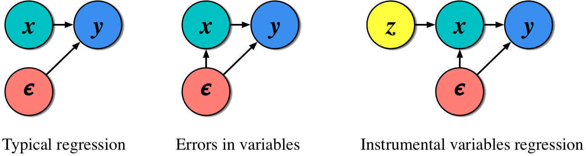
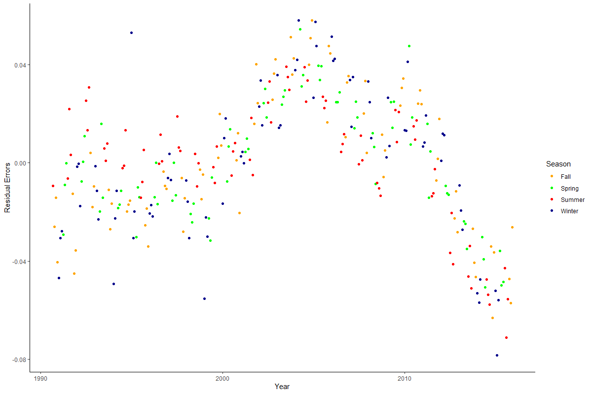

```{r setup, include=FALSE, message = FALSE, warning = FALSE}
knitr::opts_chunk$set(echo = TRUE)

## Packages
library(knitr)
library(tidyverse)
library(plm)
library(readr)
library(readxl)
library(stargazer)

```

# Introduction

```{r, echo=FALSE}
knitr::include_graphics("Images/intro_image.jpg")
```

## Purpose of This Site

The goal of this site is to have a place where you can look for examples of code. Think of this site as a log of all of the topics we cover in class and in lab sessions. I will make updates throughout the semester as we cover more advanced material. I hope this proves to be a helpful and beneficial resource and offer an easier to access format than the files posted to Canvas. If you are interested, I am happy to add you to the GitHub and you can make some direct edits to add your code!

Let me know if any of this code doesn’t run correctly or if you have any questions or issues!

## Loading Data

The easiest way to load data into R and ensure you have the correct file path is to create a folder on your computer for each assignment and place the datasets directly into that folder.

1. Create a folder on your computer for each new analysis

2. Download your Data and move the file to your newly created folder

3. Then open RStudio

4. Click the project button in the top right corner

5. Click new project

6. Click existing directory

7. Click browse and find the folder that you created

8. Click create project

9. Once your new project opens, click the blank page with a green plus sign icon in the top left corner under the file option

10. Click R script to open a new script

11. You should also be able to see your data file in the bottom right window of RStudio, click the file and follow the options depending on the file type

12. Once your data is imported into R, the code that R automatically ran will be in the console window on the bottom left, copy and paste it to your fresh R script
  - For example, in Lab 1, my code looked like: `read_excel("USstates.xlsx")`

13. Run this copy and pasted line of code whenever you open the R Project and you will never have to worry about complicated file pathing commands

14. I recommend using the assignment operator `<-` to give  your dataset a short and simple name like `df`, `dta`, or, if you are working with multiple datasets, name each something short and descriptive

# Lab I: Tidyverse

```{r, echo=FALSE}
knitr::include_graphics("Images/image_1.png")
```

### Preparation

```{r, eval = FALSE}
## Packages
library(tidyverse)
library(dplyr)
library(readxl) # Package to read Excel data
library(stargazer)

```

## Join the data sets.
- Join the cases and vaccination data by date and state.
    - Case data: [United_States_COVID-19_Cases_and_Deaths_by_State_over_Time.csv](# https://data.cdc.gov/Case-Surveillance/United-States-COVID-19-Cases-and-Deaths-by-State-o/9mfq-cb36)

    - Vaccination data: [COVID-19_Vaccinations_in_the_United_States_Jurisdiction.csv](https://data.cdc.gov/Vaccinations/COVID-19-Vaccinations-in-the-United-States-Jurisdi/unsk-b7fc)

    - Other state variables: USstates.xlsx

- Add the USstates.xlsx data and limit your dataframe to the states listed in USstates.xlsx.  
- How do you know if your merge was successful?

**ANSWER: Looking at the dataframe is useful.  Look at individual states - do the variables that are supposed to be the same (e.g. population) the same over the time period?  Do the case numbers look reasonable?**


```{r}
## Load data 
# https://data.cdc.gov/Case-Surveillance/United-States-COVID-19-Cases-and-Deaths-by-State-o/9mfq-cb36
cases <- read.csv("Data/United_States_COVID-19_Cases_and_Deaths_by_State_over_Time.csv")

# Vax data 
  # "COVID-19 Vaccinations in the United States,Jurisdiction"
  # https://data.cdc.gov/Vaccinations/COVID-19-Vaccinations-in-the-United-States-Jurisdi/unsk-b7fc
vax <- read.csv("Data/COVID-19_Vaccinations_in_the_United_States_Jurisdiction.csv")

df <- cases %>% 
  left_join(vax, by = c("submission_date" = "Date",
                        "state" = "Location"))

# Add state variables
stFacts <- read_excel("Data/USstates.xlsx", sheet = "data") %>% 
  dplyr::rename("trump2020Pct" = "trump2020_percent")

df <- df %>% 
  filter(state %in% stFacts$stateAbbr == 1) %>%
  left_join(stFacts, by = c("state" = "stateAbbr")) 

```

## Create and add the following four variables to your dataframe:  density (based on *sqMiles* and *pop2019*), deaths per capita (based on *new_death*), cases per capita (based on *new_case*) and vaccinated percent (based on *Series_Complete_12PlusPop_Pct*).

- For a specific day (based on *submission_date*), show the top five states ranked by deaths per capita and calculate the average vaccinated per capita and the mean, minimum and maximum deaths per capita.

```{r}
df <- df %>% 
  mutate("deathsPC" = 100000*new_death/pop2019, 
         "casesPC"  = 100000*new_case/pop2019,
         "vaxedPct"  = Series_Complete_12PlusPop_Pct/100,
         "density"   = pop2019/(1000000*sqMiles))

```

```{r}
# Pick a day
DATE <- "10/18/2021"

df_day <- df %>% 
  filter(submission_date == DATE) %>%
  arrange(desc(deathsPC))

# Look at data (check for negative deaths etc)
df_day %>% 
  dplyr::select(submission_date, state, new_case, new_death, deathsPC, casesPC) %>% 
  slice(1:5)

df_day %>% 
  dplyr::summarize(meanVaxedPct = mean(vaxedPct),
            meanDeath = mean(deathsPC),
            minDeath = min(deathsPC),
            maxDeath = max(deathsPC))

```

## Estimate three regression models with deaths per capita on your selected day as the dependent variable.
- Your first model will have only Trump 2020 percent as an independent variable.
- Your second model will add vaccinated percent as an independent variable.
- Your third model will add density.
- Before you estimate the models, write down your expectations about what will happen in these models.

**ANSWER: See table below. The key idea here is omitted variable bias.  If we only have Trump percent, then vaccination rates are omitted.  For October 1st, 2021, the Trump variable becomes insignificant when vaccination rates are included.  One complication, for which I suspect there is no clear answer, is whether vaccination rates are a post-treatment variable.  What do you think?**

```{r}
## Models
ols.1 <- lm(deathsPC ~ trump2020Pct, data = df_day)
summary(ols.1)

ols.2 <- lm(deathsPC ~ trump2020Pct + vaxedPct, data = df_day)
summary(ols.2)

ols.3 <- lm(deathsPC ~ trump2020Pct + vaxedPct + density, data = df_day)
summary(ols.3)

```

## Assess specific vaccines
- Create and add vaccinated percent by state for each of the Pfizer, Modern and Janssen (which is Johnson and Johnson) vaccines.
- Use _pop2019_ for population
- Use Series\_Complete\_Moderna\_18Plus, Series\_Complete\_Janssen\_18Plus and Series\_Complete\_Pfizer\_18Plus for the vaccination totals.

- Estimate a model in which deaths per capita is a function of all three vaccination rates.

- Explain what the results mean, especially in light of the results above for overall vaccination results.

- Explain how one would compare the efficacy of the individual vaccines (e.g., whether the Moderna vaccine works better than the Johnson and Johnson vaccine).

**ANSWER: The major issue here is multicollinearity.  For October 1, 2021, the overall vaccination rate was statistically significant (see models 1 - 3 in the table) yet each of the different vaccines was insignificant (see model 4).  The vaccines are multicollinear (which can be assessed with an auxilliary regression) so the loss of power is not terribly surprising.  An F-test whether _all_ the specific vaccine variables equal zero is reported for model 4 and, broadly consistent with the results in models 1 -3 we can say that we can reject the null that all individual vaccines have zero effect.  To assess whether Moderna is better than Johnson and Johnson we would do an F-test where our restricted equation adds those two vaccines.  If doing so causes a substantial reduction in fit we would reject the null that the effects of those two vaccines are equal. (And we would want to take such results with a grain of salt given endogeneity in which states have which vaccines.)**

```{r}
df <- df %>% 
  mutate("vaxedPctModerna"  = Series_Complete_Moderna_18Plus/(100*pop2019),
         "vaxedPctJans"  = Series_Complete_Janssen_18Plus/(100*pop2019),
         "vaxedPctPfizer"  = Series_Complete_Pfizer_18Plus/(100*pop2019))

df_day <- df %>% 
  filter(submission_date == DATE)

ols.4 <- lm(deathsPC ~ vaxedPctJans + vaxedPctModerna +
             vaxedPctPfizer, data = df_day)

summary(ols.4)

```

```{r, results = 'asis', collapse = TRUE}
stargazer(ols.1, ols.2, ols.3, ols.4,
          type = "html", # FOR PDF - the "asis" above makes it work
          keep.stat = c("n","ser", "rsq", "f"),
          report = "vcst",
          column.labels = c("Model 1", "Model 2", "Model 3", "Model 4"),
          digits = 3,
          dep.var.caption = "", dep.var.labels.include = FALSE)
```

# Lab II: Panel Data

```{r, echo=FALSE}
knitr::include_graphics("Images/image_2.png")
```

### Preparation

```{r, eval = FALSE}
# Load packages used in this session of R
library(knitr)
library(tidyverse)
library(plm)
library(readr)
library(readxl) # Package to read Excel data
opts_chunk$set(echo = TRUE)
options(digits = 2)

```

In this lab we will estimate standard panel data models on covid policy and cases/deaths in U.S. states.  This is not a full-fledged analysis, but rather an initial exploration of the data that illustrates how fixed effects models work.

## Load the data from Oxford_Covid_data_US_latest.csv

Oxford provides data on covid deaths/cases and policy variables by day by state. For more background, see this [data archive](https://www.bsg.ox.ac.uk/research/research-projects/coronavirus-government-response-tracker#data) or this [story](https://www.nytimes.com/interactive/2020/11/18/us/covid-state-restrictions.html) that uses the data. We will use a variable called _GovernmentResponseIndex_.  For details, see [this](https://www.bsg.ox.ac.uk/sites/default/files/2020-08/2020-08-06%20Oxford%20COVID-19%20Government%20Response%20Tracker%20expanded%20to%20US%20states%20PRESS%20RELEASE.pdf).  (And feel free to experiment with the other measures.)

## Data Organization

- Load the _Oxford_Covid_data_US_latest.csv_ data
- Limit it to U.S. states (CountryName == "United States)
- Create the following variables: RegionName, RegionCode, Date, GovernmentResponseIndex, ConfirmedCases and ConfirmedDeaths
- Add a variable to this data frame using the following code (this variable will help us when merging below)
```{r eval = FALSE}
  mutate("stAbbrev" = str_replace_all(string = RegionCode, pattern = "US_", replacement = "" ))
```

- Show the first three variables of the first three lines of this data frame.
```{r tidy = FALSE}
# Load and filter state stringency data
stPolicy = read_csv("Data/Oxford_Covid_data_US_latest.csv") %>%
  filter(CountryName == "United States" & 
           is.na(RegionName) == 0 & 
           RegionName != "" &
           RegionCode != "US_VI") %>% 
  dplyr::select(RegionName, RegionCode, Date, ContainmentHealthIndex,
         GovernmentResponseIndex, StringencyIndex, 
         ConfirmedCases, ConfirmedDeaths) %>%
  mutate("stAbbrev" = str_replace_all(string = RegionCode, pattern = "US_", replacement = "" ))

# Show the first three variables of first three lines
stPolicy[1:3, 1:3]
```

## Use the lag function in dplyr to create lagged variables for cases and deaths.  Also create "difference" (e.g., dCases) that is the change in cases for each state by date.

See slide "Creating differenced data in R" in Topic 3 class slides.

```{r tidy = FALSE}
## Create lagged value 
stPolicy = stPolicy %>% 
  group_by(RegionName) %>% 
  mutate(lagCases  = dplyr::lag(ConfirmedCases, order_by = Date),
         dCases    = ConfirmedCases - lagCases,
         lagDeaths = dplyr::lag(ConfirmedDeaths, order_by = Date),
         dDeaths   = ConfirmedDeaths - lagDeaths) %>%
  ungroup()

```

## Merge the above data frame to data in _USstates.xlsx_
- Merge by state abbreviation
- Create per capita measures of change in deaths and cases (e.g. "deathsPC" = 10000*dDeaths/pop2019).

Check your data by looking at level and lagged data for a given state for a few years.  The lagged data should match up to the previous period observation.

```{r tidy = FALSE}
# Load excel data
stFacts <- read_excel("Data/USstates.xlsx", sheet = "data")

# Merge with data frame and create per capita data
dfState <- stPolicy %>%
  left_join(stFacts, by = c("stAbbrev" = "stateAbbr")) %>% 
  mutate("deathsPC" = 10000*dDeaths/pop2019, 
         "casesPC"  = 10000*dCases/pop2019) 

# Check data
dfState %>% filter(RegionName == "California") %>% 
  dplyr::select(RegionName, Date, ConfirmedDeaths, lagDeaths, dDeaths, deathsPC) %>% 
  slice(245:248)

```

## Estimate a pooled model of total cases per capita as a function of state policy. Discuss.  

```{r tidy = FALSE}
ols.1 = lm(casesPC ~ GovernmentResponseIndex, data = dfState)
summary(ols.1)
```


## Estimate a one-way fixed effect model where the fixed effect is state. (Note that state is indicated in a variable called *RegionName*.) Estimate using both LSDV and the _de-meaned_ version in the plm package.  Can you identify a source of bias? 
```{r tidy = FALSE, warning = FALSE}

fe.1 = lm(casesPC ~ GovernmentResponseIndex + factor(RegionName), data = dfState)
#summary(fe.1)
coefficients(summary(fe.1))[1:2,]

fe.1plm = plm(casesPC ~ GovernmentResponseIndex, 
  data = dfState, 
  index = c("RegionName","Date"),
  model="within")
summary(fe.1plm)

```

## Estimate a two-way fixed effect model where the fixed effects are state and date. Estimate using both LSDV and the _de-meaned_ version in the plm package.  Does this model address the source of bias identified earlier?


```{r tidy = FALSE}

fe.2 = lm(casesPC ~ GovernmentResponseIndex + factor(RegionName) + factor(Date), data = dfState)
#summary(fe.2)
# Show non-fixed effect coefficients
coefficients(summary(fe.2))[1:2,]

fe.2plm = plm(casesPC ~ GovernmentResponseIndex, 
  data = dfState, 
  index = c("RegionName","Date"),
  model="within", 
  effect="twoways")
summary(fe.2plm)

```

### This is an initial analysis.  We would also want to  
- think through whether it is useful to control for days of the week (there is a well-known pattern in reporting across days of the week)
- assess the data for outliers (e.g, `min(dfState$casesPC, na.rm = TRUE)`)
- consider a lagged dependent variable
- For more, read [this](https://cdn.vanderbilt.edu/vu-my/wp-content/uploads/sites/2318/2020/05/11154933/Covid-DD_v2.pdf)

# Lab III: 2SLS & Instrumental Variables

```{r, echo=FALSE}

```


### Preparation

```{r}
## Packages
library(haven)  ## Package to read Stata data
library(ivreg) ## Package to run 2sls
library(fixest) ## This package can also run 2SLS
library(tidyverse) ## For tidyverse commands
library(here) ## Importing Data

## Loading Data
hajj_public <- read_dta("Data/hajj_public.dta")

```

Do important life experiences influence political and social views?  In particular, does performing the Hajj pilgrimage to Mecca affect the views of pilgrims?  David Clingingsmith, Asim Ijaz Khwaja, and Michael Kremer (2009) analyze this question by using two-stage least squares to compare successful and unsuccessful applicants in a lottery used by Pakistan to allocate Hajj visas.

We will conduct pared-down models. The paper creates indices and implements additional statistical procedures to produce a broader and clearer picture. It is not a bad idea to read this paper to see how we can extend the methods we learn in class to your own work. I posted the paper on Canvas for your convenience. 

Data description

Variable  | 	Description
------------- | -------------
hajj2006 | Went on Hajj trip in 2006
success  | Won the lottery to have expenses covered for Hajj
ptygrp   |  Categorical variable indicating size of party for Hajj trip
smallpty |  1 if small party group, 0 otherwise
urban    |  1 if live in urban area, 0 otherwise
age      | Age
female   | 1 if female, 0 otherwise
literate | 1 if literate, 0 otherwise
x_s7q10  | _Natl affairs_:  How often do you follow national affairs in the news on television or on the radio? Binary: 0=Twice a week or less, 1=Several times a week or more
x_s14aq10 | _Religious_: Do others regard you as religious? Binary: 1=Religious, 0=Not Religious
x_s10bq4 | _OssamaIncorrect_: Do you believe goals Ossama is fighting for are correct?  Binary: 1=Not Correct at All/Slightly Incorrect, 0=Correct/Absolutely Correct
x_s7q12a | _GovtForce_: Govt should force people to conform to Islamic injunctions. Binary: 1=Agree Strongly/Agree, 0=Neutral/Disagree/Strongly Disagree 
x_s7q1 | _NatlInterest_ How interested would you say you are in national affairs? Binary: 0=Not interested, 1=Interested 
x_s3q3 | _Happy_: how happy are you? From 1 (not at all happy) to 4 (very happy).
x_s10eq2 | _GirlsSchool_: In your opinion, girls should attend school. Binary: 0=Disagree, 1=Agree
s10dq1 | _JobsWomen_: When jobs are scarce, men should always have more right to a job than women. Binary: 0=Generally agree, 1=Generally Disagree

More details on these and other variables are available in Appendix 3 of the paper. If you cannot access the \emph{Quarterly Journal of Economics} version, the SSRN version works as well.

## Estimate a basic OLS model with "Do others regard you as religious" as the dependent variable as a function of Hajj2006. Explain how there might be endogeneity.

```{r}
hajj_public %>%
  lm(x_s14aq10~hajj2006, data=.) %>%
  broom::tidy()
```

There may be endogeneity due to baseline bias caused by the religiosity of respondents. A more religious respondent may be more likely to go on a Hajj trip and be classified as religious by others. Going to church, like actually being religious, is also a factor that may be correlated with x and lurking in the error term.

## Explain how the "success" variable may satisfy the conditions for a instrumental variable.

The two conditions, inclusion and exclusion, are:
$$Cov(X,Z)\ne0$$
&
$$Cov(Z,\epsilon)=0$$

The lottery is randomizes, which means it is not correlated with the error term, or anything else other than the treatment variable, in our model. Further, it meaningfully effects our key independent which is tested below.

## Estimate a 2SLS model _Religious_ as a function of Hajj2006.

```{r}
## With library(ivreg)
hajj_public %>%
  ivreg(x_s14aq10~hajj2006 | success, data=.) %>%
  broom::tidy()

```

## Show the first stage from the 2SLS model above.  Explain the implications of the results.

```{r}
hajj_public %>%
  lm(hajj2006~success, data=.) %>%
  broom::tidy()

```

The t-score is `r hajj_public %>% lm(hajj2006~success, data=.) %>% broom::tidy() %>% filter(term=="success") %>% dplyr::select(statistic)` which is much higher than the 3 threshold. Our instrument meets in the inclusion condition.

## Add covariates for age, literacy, urban, group size and gender to the 2SLS model _Religious_ as a function of Hajj2006. What is different?  Which variables are included in the first stage?

```{r}
hajj_public %>%
  ivreg(x_s14aq10~hajj2006 + age + literate + ptygrp + female + urban | 
          success + age + literate + ptygrp + female + urban, data=.)
```

## Run multiple 2SLS models with OssamaIncorrect, GovtForce, NatlInterest, Happy, GirlsSchool and JobsWomen variables as dependent variables. Use the list of covariates from earlier. If you want, try using a loop or lapply (but not necessary).

```{r}
## OssamaIncorrect
hajj_public %>%
  ivreg(x_s10bq4~hajj2006 + age + literate + ptygrp + female + urban | success +
                 age + literate + ptygrp + female + urban, data=.) %>%
  broom::tidy()


## GovtForce
hajj_public %>%
  ivreg(x_s7q12a~hajj2006 + age + literate + ptygrp + female + urban | success + 
                 age + literate + ptygrp + female + urban, data=.) %>%
  broom::tidy()


## NatlInterest
hajj_public %>%
  ivreg(x_s7q1~hajj2006 + age + literate + ptygrp + female + urban | success + 
                 age + literate + ptygrp + female + urban, data=.) %>%
  broom::tidy()

## Happy
hajj_public %>%
  ivreg(x_s3q3~hajj2006 + age + literate + ptygrp + female + urban | success + 
                 age + literate + ptygrp + female + urban, data=.) %>%
  broom::tidy()

## Girl School
hajj_public %>%
  ivreg(x_s10eq2~hajj2006 + age + literate + ptygrp + female + urban | success + 
                 age + literate + ptygrp + female, data=.) %>%
  broom::tidy()

## Jobs Women
hajj_public %>%
  ivreg(x_s10dq1~hajj2006 + age + literate + ptygrp + female + urban | success +
                  age + literate + ptygrp + female, data=.) %>%
  broom::tidy()
```

```{r}
## Loop

## DVs 
dvs <- c("hajj_public$x_s10bq4", "hajj_public$x_s7q12a", "hajj_public$x_s7q1", 
         "hajj_public$x_s3q3", "hajj_public$x_s10eq2", "hajj_public$x_s10dq1")

## Loop
for(i in 1:length(dvs)){
  model <- paste("model",i, sep="")
  m <- ivreg(as.formula(paste(dvs[i],"~ hajj2006 + age + literate + ptygrp +
  female + urban | success + age + literate + ptygrp + female + urban")), data = hajj_public)
  assign(model,m)}

model_list <- list(model1, model2, model3, model4, model5, model6)

b  <- round(sapply(model_list, function(x) x$coefficients["hajj2006"]) , 2)
t <- round(sapply(model_list, function(x) {
            summary(x)$coefficients["hajj2006", 3]}) , 2)

names <- c("OsamaIncorrect", "GovtForce", "NatlInterest", "Happy", "GirlsSchool", "JobsWomen")

data.frame(DV = names, b, t) %>%
  arrange(desc(b))

```

# Lab IV: Data Visualization

```{r, echo=FALSE}

```

### Preparation

```{r, message = FALSE, warning = FALSE}
# Load packages used in this session of R
library(knitr)
library(tidyverse)
library(ggplot2)

opts_chunk$set(echo = TRUE)
options(digits = 2)
```

Our goal is to visualize the difference between the population percent (_popPct_) and the survey percent (_svyPct_) for various age groups. We'll use the data in the table below (and of course, a full viz would include more subgroups). Create designs on how to present this information. Be ready to share concept and actual viz with the entire class. You can either work individually or in small groups. Do not include code with your visualizations. Instead, create an appendix that displays each code chunk at the end of the document. Make sure there are no warnings or messages displaying too.

Use the simulated data to make at least two plots: one in Base R and one in `library(ggplot)`. Then you can use a dataset of your choice for the last two visualizations or keep working with the fake data.

```{r, echo=FALSE, eval=TRUE, warning=FALSE, message=FALSE}
dataF <- data.frame("age" = c("18 to 29", "36 to 50", "51 to 64", "65+"),
                "popPct" = c(29, 21, 30, 20),
                "svyPct" = c(19, 21, 32, 28))

```

```{r, warning=FALSE, message=FALSE}
df <- data.frame("age" = c("18 to 29", "36 to 50", "51 to 64", "65+"),
                "popPct" = c(29, 21, 30, 20),
                "svyPct" = c(19, 21, 32, 28))

kable(df, caption = "Table: Population and survey percentages by age group")
```

## Base R Version

```{r, warning=FALSE, message=FALSE}
Age18to29 <- c(19, 29)
Age36to50 <- c(21,21)
Age51to64 <- c(32, 30)
Over65 <- c(28, 20)
age_groups <- cbind(Age18to29, Age36to50, Age51to64, Over65)
barplot(age_groups, beside=T, xlab="Age Group", names.arg=
          c("18 - 29", "36 - 50", "51 - 64", "65+"), ylab="Percent",
        main = "Percent Surveyed and Percent in Population by Age Group",
        ylim = c(0,35), las=1)
legend("bottomleft",c("Surveyed %", "Population %"),
       fill=c("black", "light gray"), horiz=FALSE, cex=0.73, bg="white")
```

## Base R Version 2

```{r, warning=FALSE, message=FALSE}
dataDiff = data.frame(category = c("18 to 35", "36 to 50", 
                             "51 to 64", "65+", 
                             "Female", "Male",
                             "Black",
                             "No HS", "HS grad", "Some college",
                             "2 year college", "4 year college",
                             "Post-grad"))
dataDiff$diff = -1*c(28.8 - 19, 21.1-20.9, 29.8-31.8, 20.1 - 28.4, 
               50.8 - 47.3, 49.2 - 52.7,
               11.8 - 8.9,
               6.8 - 2.8, 30.6 - 19.7, 23 - 15.7, 10.6 - 11.3, 18.7 - 28.6, 10.4 - 21.9)

par(mfrow=c(1, 1), # mar(south, west, north, east)
    mar=c(2., 0.25, 0.5,  0.5), 
    oma=c(1., 0.25, 0.5,  0.3))	 	
plot(c(-16, 12), c(0.5, dim(dataDiff)[1]+1), type="n", 
     xlab = "", ylab = "", xaxt='n', yaxt='n', 
     bty = 'n')
axis(1, at = seq(-12, 12, by = 2), 
     labels = seq(-12, 12, by = 2), tick = T, 
     cex.axis = 1.0, mgp = c(2,.4,0))
mtext("Degree of misrepresentation", 	
      side = 1, line = 1.75, at = 0, 
      cex = 1)
abline(v = 0, col = "grey")
text(9, dim(dataF)[1]+1, "Over-represented", cex = 0.9, 
     col = "darkgrey")
text(-10, dim(dataF)[1]+1, "Under-represented", cex = 0.9, 
     col = "darkgrey")

# Plot age group
points(dataDiff$diff[1:4], dim(dataDiff)[1]:(dim(dataDiff)[1]-3), 
       col = "darkblue", pch = 20, cex = 1.5)
lines(dataDiff$diff[1:4], dim(dataDiff)[1]:(dim(dataDiff)[1]-3), 
      col = "darkblue", lwd = 3)
for(aa in 1:4){
  text(-14., dim(dataDiff)[1]-aa+1, dataDiff$category[aa], cex = 0.9,
       col = "darkblue")
}
abline(h = dim(dataDiff)[1]-aa+0.5, col = "grey")

# Plot gender
points(dataDiff$diff[5:6], (dim(dataDiff)[1]-4):(dim(dataDiff)[1]-5), 
       col = "#cc6600", pch = 20, cex = 1.5)
lines(dataDiff$diff[5:6], (dim(dataDiff)[1]-4):(dim(dataDiff)[1]-5), 
      col = "#cc6600", lwd = 3)
for(aa in 5:6){
  text(-14., dim(dataDiff)[1]-aa+1, dataDiff$category[aa], cex = 0.9,
       col = "#cc6600")
}
abline(h = dim(dataDiff)[1]-aa+0.5, col = "grey")

# Plot race
points(dataDiff$diff[7], (dim(dataDiff)[1]-6):(dim(dataDiff)[1]-6), 
       col = "darkred", pch = 20, cex = 1.5)
lines(dataDiff$diff[7], (dim(dataDiff)[1]-6):(dim(dataDiff)[1]-6), 
      col = "darkred", lwd = 3)
for(aa in 7){
  text(-14., dim(dataDiff)[1]-aa+1, dataDiff$category[aa], cex = 0.9,
       col = "darkred")
}
abline(h = dim(dataDiff)[1]-aa+0.5, col = "grey")

# Plot education
points(dataDiff$diff[8:13], (dim(dataDiff)[1]-7):(dim(dataDiff)[1]-12), 
       col = "darkgreen", pch = 20, cex = 1.5)
lines(dataDiff$diff[8:13], (dim(dataDiff)[1]-7):(dim(dataDiff)[1]-12), 
      col = "darkgreen", lwd = 3)
for(aa in 8:13){
  text(-14., dim(dataDiff)[1]-aa+1, dataDiff$category[aa], cex = 0.9,
       col = "darkgreen")
}
```

## `library(ggplot)` Version 1 

```{r, warning=FALSE, message=FALSE}

df %>% 
  mutate(Population = popPct, Survey = svyPct) %>%
  dplyr::select(-popPct, -svyPct) %>%
  pivot_longer(-age, names_to="Group", values_to="Percent") %>%
  ggplot(aes(x=age, y=Percent, fill=Group)) +
  geom_bar(stat="identity", position="dodge") +
  scale_fill_grey() + 
  theme_bw() +
  labs(x = "Age Group", y = "Percent",
       title = "Population and Survey Sample Proportions by Age Group")

```

## `library(ggplot)` Version 2

```{r, warning=FALSE, message=FALSE}
df %>% 
  mutate(Population = popPct, Survey = svyPct) %>%
  dplyr::select(-popPct, -svyPct) %>%
  pivot_longer(-age, names_to="Group", values_to="Percent") %>%
  ggplot(aes(x=age, y=Percent, fill=Group)) +
  geom_bar(stat="identity", position="dodge") +
  coord_flip() +
  scale_fill_grey() + 
  theme_minimal() +
  labs(x = "Age Group", y = "Percent",
       title = "Population and Survey Sample Proportions by Age Group")

```

## Alternative Plot of Your Choice

```{r, warning=FALSE, message=FALSE}
library(apyramid)

df %>% 
  mutate(Population = popPct, Survey = svyPct) %>%
  dplyr::select(-popPct, -svyPct) %>%
  pivot_longer(-age, names_to="Group", values_to="Percent") %>%
  mutate(age = as.factor(age)) %>%
  age_pyramid(data = ., age_group = "age", split_by = "Group",  
              count = "Percent", show_midpoint = FALSE) +
  scale_fill_grey() +
  theme_bw() +
  labs(x="Age Group", y="Percent", fill=NULL,
       title = "Percent Surveyed and Percent in Population by Age Group")
```

# Lab V: Experiments

```{r, echo=FALSE}
knitr::include_graphics("Images/image_5.jpg")
```

### Preparation

```{r, include=TRUE, message = FALSE, warning = FALSE}
library(knitr)
library(haven)
library(tidyverse)
library(car)
```

Williamson and Malik (2020) used a survey experiment to examine the public response to how Egyptians responded to different framings regarding a protest in which protesters were killed by police.

All respondents were given the following statement: "Last year, police raided an apartment in 6 October City. During the raid, they killed 9 members of the Muslim Brotherhood." 

Respondents were assigned with equal probability to a control group that got no more information or one of three treatment groups that received additional information.

- Respondents in the first treatment group were provided a paragraph that justified the killings from the security forces perspective.

- Respondents in the second treatment group were provided a paragraph that criticized the killings from a human rights perspective.

- Respondents in the third treatment group were provided both the security forces and human rights perspectives.


Two outcomes were measured: 

- if respondents thought the police tactics were justified, and

- if the police should the police be held accountable for killing the nine men. So that both variables are coded in same direction, this variable is coded as 1 if the respondent gave a pro-police answer (saying the police did not need to be held accountable).

Data description

Variable  | 	Description
------------- | -------------
just_binary_main | 1 if the respondent said the police tactics were justified; 0 otherwise.
not_acc_binary_main | 1 if the respondent said the police should definitely or probably not be held accountable;  0 otherwise. We call this variable no-accountability
treat_b1  | 1 if respondent was given the pro-police paragraph
treat_b2  | 1 if respondent was given the human rights paragraph
treat_b3  | 1 if respondent was given both the pro-police and human rights paragraphs
sisi_vote | 1 if the respondent voted for Sisi
not_voteboycott | 1 if the respondent did not vote for some other reason than boycotting the election
opposition_vote_boycott | 1 if the respondent either voted for the opposition candidate or boycotted the election
education  | from 1 (no formal education) to 8 (graduate degree). Values from 6 to 8 went to college.
income | 1 = Less than 500 pounds per month, 2 = 500 to 1000 pounds per month, 3 = 1000 to 4000 pounds per month, 4 = 4000 to 10000 pounds per month, 5 = More than 10000 pounds per month
male| 1 for men, 0 otherwise
age_cat | age categories: 1 is less than 35, 2 is 35 to 50 and 3 is over 50.

[Published paper](https://journals.sagepub.com/doi/abs/10.1177/0022343320961835?journalCode=jpra) (paywalled) 

[Draft version of the paper](https://static1.squarespace.com/static/5b23cff07c9327b8cde5c995/t/5d5c3f1bc49f210001338d1f/1566326555630/Contesting+Repression+-+Website.pdf)

## Why is an experiment useful in this context?

Simply asking respondents if they agree or disagree with the police does not answer if and how different messages work.  If respondents were simply asked if they agree with the either the pro-police or human rights messages it may be difficult to separate out whether the message was persuasive or whether the respondent was predisposed to approve of the argument. 

## Is there evidence of balance in the treatment?  Why is this relevant? Check for balance of each treatment with respect to age category, gender, education, income, voting for Sisi and not voting for non-boycott reasons.

```{r}
## Loading saved dataset
load("~/GOVT8002/Spring 2024/Lab V/Ch10_lab_EgyptProtests.RData")

## Removing NAs
dta <- dta[is.na(dta$just_binary_main)==0 & is.na(dta$not_acc_binary_main)==0,]

dep_vars <- dta %>% 
  dplyr::select(age_cat, male, education, sisi_vote, not_voteboycott, income)

b_test <- lapply(dep_vars, function(bal) { 
  lm(bal ~ dta$treat_b1 + dta$treat_b2 + dta$treat_b3)})

## Extracting Slopes and P Values
slopes  <- round(sapply(b_test, function(x) x$coefficients), 2)
p <- round(sapply(b_test, function(x) {
            summary(x)$coefficients[,4]}), 2)

## Showing Results
balance_results = data.frame(b1= slopes[2,], b1.p = p[2,], 
                            b2= slopes[3,], b2.p = p[3,],
                            b3= slopes[4,], b3.p = p[4,]) 
balance_results

```

There is some evidence of imbalance.

## Is there evidence of an overall unbalanced sample?  Look at gender and discuss results in light of your answer on treatment-balance above.

```{r}
table(dta$gender)

dta %>%
  group_by(gender) %>%
  count()

```

## What is the effect of the treatments on whether respondents viewed the police tactics as justified? Run one model with only the treatment variables and another that includes controls for age category, gender, education, income, voting for Sisi and not voting for non-boycott reasons.

```{r}
## Without Controls
dta %>%
  lm(just_binary_main~treat_b1 + treat_b2 + treat_b3, data=.) %>%
  summary()

## With Controls
dta %>%
  lm(just_binary_main~treat_b1 + treat_b2 + treat_b3 + factor(age_cat) + 
       male + education + income + sisi_vote + not_voteboycott, data=.) %>%
  summary()
```

## What is the effect of the treatments on whether respondents viewed the police tactics as justified?

```{r}
dta %>%
  lm(not_acc_binary_main ~ treat_b1 + treat_b2 + treat_b3, data=.) %>%
  summary()

dta %>%
  lm(not_acc_binary_main ~ treat_b1 + treat_b2 + treat_b3+ factor(age_cat) + 
       male + education + income + sisi_vote + not_voteboycott, data=.) %>%
  summary()

```

## Test whether the effects of treatment 1 (police-favorable message) are the same as treatment 3 (both sides) for each dependent variable. Feel free to use the linearHypothesis function in the car package.

```{r}
reg.1 <- lm(just_binary_main~treat_b1 + treat_b2 + treat_b3 +
               factor(age_cat) + male + education + income +
               sisi_vote + not_voteboycott, data=dta)

linearHypothesis(reg.1, "treat_b1=treat_b3")

reg.2 <- lm(not_acc_binary_main~treat_b1 + treat_b2 + treat_b3 +
               factor(age_cat) + male + education + income +
               sisi_vote + not_voteboycott, data=dta)

linearHypothesis(reg.2, "treat_b1=treat_b3")
```

## In some political contexts, messages have a different effect on people with less engagement in politics.  Are there heterogeneous treatment effects by those who did not vote for reasons other than to boycott the election and those who did not? Feel free to explore multiple other ways there could be heterogeneous effects (e.g., perhaps there are different effects on Sisi supporters), but you only need to report on possible differential effects of the treatments on the "not-accountable" dependent variable. 

```{r}
dta %>%
  lm(not_acc_binary_main ~ not_voteboycott*treat_b1 + not_voteboycott*treat_b2 + 
                          not_voteboycott*treat_b3 +factor(age_cat) + male + 
                          education + income + sisi_vote, data = .) %>%
  summary()
```

# Lab VI: Lists, Loops, & Functions in R

```{r, echo=FALSE}

```

### Preperation

```{r}
## Packages
library(plyr)
library(tidyverse)
library(readxl)
library(readr)
library(lubridate)
library(knitr)

```

## Load data. Stock price data is in stocks2020.csv.  Presidential prices are in  USPres_2020_Price History By Market -Bulk.xlsx.

```{r, warning=FALSE, message=FALSE}
## Reading in stock data
stk <- read_csv("~/GOVT8002/Spring 2023/Lab VII/stocks2020.csv",  col_names = TRUE)

## Reading in presidential market data
pres_mkt <- read_excel("~/GOVT8002/Spring 2023/Lab VII/USPres_2020_Price History By Market -Bulk.xlsx", 
                       col_names = TRUE) %>%   
  dplyr::rename("date" = "Date (ET)", 
         "name" = "Contract Name", 
         "price" = "Close Share Price")

```

## Create data frame with daily price data for Trump in 2020

```{r}
## Creating daily price data for Trump
trump2020 <- pres_mkt %>%
  filter(year(date) > 2019 & name == "Donald Trump") %>%
  dplyr::select(c(date, "Trump" = price))

```

## Merge the stock price and Trump price data

```{r}
## Joining the two datasets
stk_pres <- left_join(stk, trump2020, by = "date")

```

## Create a list of stock ticker names (do not include DJI as a ticker)

```{r}
## Creating list of ticker names
stk_tickers <- 
  c(names(stk)[!names(stk) %in% c("date", "DJI")])

## Creating number of stocks
stk_num <- length(stk_tickers)

```

## Create a function that calculates daily percent change.  
- Use the `dplyr::lag()` function inside your function.
- Apply the function to price data in your data frame using the `mutate_at()` function.

```{r}
## Price Change Function
pct_change <- function(x){
  
(x - dplyr::lag(x))/dplyr::lag(x)
  
}

## Daily Change Dataset
daily_df <- stk_pres %>% 
  dplyr::mutate_at(c("DJI", "Trump", stk_tickers), pct_change) %>% 
  dplyr::select(c(date, c("DJI", "Trump", stk_tickers)))

```

## Check that your function worked

```{r}
cbind(stk_pres$AAPL, daily_df$AAPL)[1:3,]

```

## Loop thru list of tickers and run regressions in which daily change in stock price is a function of change in DJIA and change in Trump price.  Create a data frame that stores the coefficient, standard error and t-stat for the Trump variable for each stock.  Include a column that has the stock ticker in that data frame as well.  Show the first six rows of the data frame with the ticker and coefficient information.

```{r}
## Preparing Data Frame to store results
ols_results <- data.frame("row" = 1:stk_num,
                         "ticker" = NA, 
                         "coef" = NA, 
                         "se" = NA,
                         "tStat" = NA)

## Looping Though Regressions
for(i in 1:stk_num){
  daily_df$temp <- unlist(daily_df[, i + 3])
  ols.1 <- lm(temp ~ DJI + Trump, data = daily_df)
  ols_results[i, "ticker"] <- stk_tickers[i]
  ols_results[i, 3:5] <- round(summary(ols.1)$coefficients["Trump", 1:3], 3)
}

## Showing results
head(ols_results)

```

### _IF INTERESTED IN DOING MORE (not required or for credit)_: Use `lapply()` (list apply) to regress stock price on Trump and DJI for all stock tickers.

```{r}
## Now with lapply()
ols_results2 <- lapply(stk_tickers, function(x){
  daily_df$temp = unlist(daily_df[, which(names(daily_df) == x)])
  ols.1 <- lm(temp ~ DJI + Trump, data = daily_df)
})

head(ols_results2)

```

# Lab VII: Regression Discontinuity Designs

```{r, echo=FALSE}
knitr::include_graphics("Images/image_7.jpg")
```

### Preparation

```{r, message = FALSE, warning = FALSE}
## Packages
require(knitr)
require(haven)
require(dplyr)
library(rdrobust)

# Load data: data saved as object named "dta"
load("~/GOVT8002/Spring 2023/Lab VIII/Ch11_Lab_AlcoholCrime.RData")

```

Carpenter and  Dobkin (2015) analyzes the relationship between alcohol and crime using a regression discontinuity design.

In this lab we will replicate the results and then explore different specifications.  As you will see, some reasonable alternative specifications yield quite different results.  The goal here will be to see if we can make any progress in explaining why the results vary as we vary the specification.

From the codebook: "The individual level arrest records are collapsed into arrest counts by age in days for each crime type  in the SAS program "P01 Estimate Age Profile of Crime Rates.sas". This program uses populations estimated from the census in "P00 Estimate Population Denominators.sas" to compute arrest rates per 10,000."

The main variables are 

- *all_r*: number of arrrests across all categories.  Our main dependent variable. Arrest data is also broken down for *violent_r*, *property_r*, *ill_drugs_r* and *alcohol_r*
- *post* a dumm variable indicating the individual is over 21 years of age
- *linear*: the number of years from being age 21 (that is, *linear* = 1.0 indicates 22 year olds.  Negative values means the individual is under 21 and positive values indicate the individual is over than 21.
- *square*: the squared value of linear
- *linear_post*: interaction of linear and post
- *square_post*: interaction of square and post
- birthday dummies: e.g., birthday_19 is a dummy for a person's 19th birthday and birthday_19_1 is a dummy for the day after a person's 19th birthday. Use this code in your formula: + birthday_19  + birthday_19_1 + birthday_20  + birthday_20_1 + birthday_21  + birthday_21_1 + birthday_22 + birthday_22_1 + birthday_23 + birthday_23_1

See Carpenter, Christopher and Carlos Dobkin. 2015. The Minimum Legal Drinking Age and Crime. *The Review of Economics and Statistics.* 97:2, 521-524.

## Replicate the main result using the specification for Table 1. In this model, the RD allows for differential quadratic models above and below the threshold and also has dummy variables for birthdays.  The data is limited to observations within 2 years of 21.

```{r message = FALSE}
## Basic RD model
rd_basic <- lm(all_r ~ post + linear,  data=dta[abs(dta$linear) <= 2, ])
summary(rd_basic)

## Differing Slopes
rd_basic <- lm(all_r ~ post*linear,  data=dta[abs(dta$linear) <= 2, ])
summary(rd_basic)

## Model with covariates and vary
rd_replicate <- lm(all_r ~ post + linear + square + linear_post + square_post + birthday_19  + birthday_20  + birthday_20_1 + birthday_21  + birthday_21_1 + birthday_22 + birthday_22_1,  data=dta[abs(dta$linear) <= 2, ])
summary(rd_replicate)

## Diagnostic plot
hist(dta$linear, main = "Diagnostic Plot", xlab = "Age", las=1)
```

## Estimate a series of models with slightly different specifications. First, try the above specification with only linear age variable, first fixing slope to be the same above and below the threshhold and then allowing slope to vary above and below the threshhold.

```{r}
## Additional Models
RD.1 <- lm(all_r ~ post + linear + birthday_19  + birthday_20  + birthday_20_1 + birthday_21  + birthday_21_1 + birthday_22 + birthday_22_1,  data=dta[abs(dta$linear) <= 2, ])
summary(RD.1)

RD.2 <- lm(all_r ~ post + linear + linear_post + birthday_19  + birthday_20  + birthday_20_1 + birthday_21  + birthday_21_1 + birthday_22 + birthday_22_1,  data=dta[abs(dta$linear) <= 2, ])
summary(RD.2)

```

## Now see what happens when you use a different window sizes.  Feel free to experiment (but only need to report one specification.)

```{r}
## Different window sizes
RD.3 <- lm(all_r ~ post + linear + linear_post,  data=dta[abs(dta$linear) <= 1, ])
summary(RD.3)

RD.4 <- lm(all_r ~ post + linear + linear_post,  data=dta[abs(dta$linear) <= 3, ])
summary(RD.4)

```

## To figure out what is going on, let's create some figures. First, let's re-create Figure 1 in the paper. I provide the code to create a binned graph for the alcohol arrest rate.  Your task is to add another arrest category to the plot.

```{r}
## With rdrobust
rdplot(dta$all_r , dta$linear, c=0, kernel = "triangular", x.label = "Year from Age Cutoff", y.label
= "Arrest Rate", title = "Effect of Alcohol on Crime", binselect = "es")

# The original paper used 2 week intervals for bins, using the following to 
# generate a number indicating age in years grouped into 2 week intervals
dta$age_fortnight = 21 + (14*floor(dta$days_to_21/14))/365

# Create a variable placing each observation in a "bin"
dta$bin  = rep(1:length(unique(dta$age_fortnight)), table(dta$age_fortnight))

# Use "window" to set how wide the window is above and below 21; e.g. window = 2
# limits years 19 to 23
window = 2


# Create a dataframe that contains average crime rates grouped by bin
# Use the dplyr package to simplify data organization
dta_bin <-  dta %>% 
  dplyr::select(days_to_21, all_r, property_r, age_fortnight, alcohol_r, bin) %>%
  group_by(bin)

# Quadratic model with varying parameters below and above threshhold
# ALCOHOL ARREST RATES
Alc.RD.Replicate.left = lm(alcohol_r ~ linear + square, dta[dta$linear > -window & dta$linear <0, ])
summary(Alc.RD.Replicate.left)

Alc.RD.Replicate.right = lm(alcohol_r ~ linear + square, dta[dta$linear  < window & dta$linear >0, ])
summary(Alc.RD.Replicate.right)

# Quadratic model with varying parameters below and above threshhold
# PROPERTY ARREST RATES
Prop.RD.Replicate.left = lm(property_r ~ linear + square, dta[dta$linear > -window & dta$linear <0, ])
summary(Prop.RD.Replicate.left)

Prop.RD.Replicate.right = lm(property_r ~ linear + square, dta[dta$linear  < window & dta$linear >0, ])
summary(Prop.RD.Replicate.right)

# Create a # scatter plot
plot(dta_bin$age_fortnight, dta_bin$alcohol_r,  type = "p", pch = 1, cex = 0.5, cex.main = 0.8, xlab = "", ylab = "", xaxt='n', yaxt='n', ylim = c(180, 480))
axis(2, las = 1, tick = T, cex.axis = .8, mgp = c(2,.7,0))
axis(1, tick = T, at= seq(17, 25, by=1), labels =seq(17, 25, by=1),cex.axis = .8, mgp = c(2,.3,0))
mtext("Arrest rate", 	las = 1, side = 2, at = 510, line = -0.2, cex = 1)	
mtext("Age at time of arrest", 	side = 1, line = 1., cex = 1)

# Add fitted lines from "left" and "right" models
# ALCOHOL
points(seq(21 - window, 21, by = 0.1), coef(Alc.RD.Replicate.left)[1] + coef(Alc.RD.Replicate.left)[2]*seq(-window, 0, by = 0.1) +
         coef(Alc.RD.Replicate.left)[3]*(seq(-window, 0, by = 0.1)^2), type = 'l', lwd = 2)
points(seq(21, 21 + window, by = 0.1), coef(Alc.RD.Replicate.right)[1] + coef(Alc.RD.Replicate.right)[2]*seq(0, window, by = 0.1) +
         coef(Alc.RD.Replicate.right)[3]*(seq(0, window, by = 0.1)^2), type = 'l', lwd = 2)


```

## Now create a figure based on a linear model.  You can try different window sizes but need only report one. Do this for alcohol (and feel free to add other crimes, but not required.)

```{r}
# Create a dataframe that contains average crime rates grouped by bin, limited to the 
# window set by the window parameter
window = 4
library(dplyr)

# Linear model with varying slopes below and above threshold
# ALCOHOL ARREST RATES
Alc.RD.linear.left = lm(alcohol_r ~ linear, dta[dta$linear > -window & dta$linear <0, ])
summary(Alc.RD.linear.left)

Alc.RD.linear.right = lm(alcohol_r ~ linear, dta[dta$linear  < window & dta$linear >0, ])
summary(Alc.RD.linear.right)

# Create a scatter plot
plot(dta_bin$age_fortnight, dta_bin$alcohol_r,  type = "p", pch = 1, cex = 0.5, cex.main = 0.8, xlab = "", ylab = "", xaxt='n', yaxt='n')
axis(2, las = 1, tick = T, cex.axis = .8, mgp = c(2,.7,0))
axis(1, tick = T, at= seq(17, 25, by=1), labels =seq(17, 25, by=1),cex.axis = .8, mgp = c(2,.3,0))
mtext("Arrest rate", 	las = 1, side = 2, at = 520, line = -0.2, cex = 1)
mtext("Age at time of arrest", 	side = 1, line = 1., cex = 0.8)

# Add fitted lines from "left" and "right" models
points(seq(21 - window, 21, by = 0.1), coef(Alc.RD.linear.left) [1] + coef(Alc.RD.linear.left) [2]*seq(-window, 0, by = 0.1), lwd = 2, col = "darkblue", type = 'l')
points(seq(21, 21 + window, by = 0.1), coef(Alc.RD.linear.right)[1] + coef(Alc.RD.linear.right)[2]*seq(0, window , by = 0.1), lwd = 2, col = "darkblue", type = 'l')

```

# Lab VIII: Time Series

```{r, echo=FALSE}

```

## Preparation

```{r, warning=FALSE, message=FALSE}
## Setup Options
options(digits = 3)

## Packages
library(haven)
library(AER)
library(orcutt)
library(tidyverse)
library(lubridate)
library(lmtest)
library(sandwich)

## Loading Data
load("~/GOVT8002/Spring 2023/Lab IX/Ch13_Lab_GasPrices.RData")

```

## Data description:

Variable  | 	Description
------------- | -------------
year	| Year
month	| Month
time	| Time identifier (1 for first observation, etc)
logMilesNA	| Log of vehicle miles traveled (in millions) in the U.S., not seasonally adjusted
logLightTruckSales 	| Log of retail sales of light weight trucks in the U.S. (in thousands)
logGasReal	| Log of real price of gas
unem	| Unemployment rate
logPop 	| Log of U.S. population (in thousands) 

## Estimate a model with the log of miles driven (use the unadjusted data: logMilesNA) as a function of log gas prices, unemployment and log of population.  (Don't account for autocorrelation.)  Is the effect of gas statistically significant?

```{r}
## Model 1
reg.1 <- dta %>%
  lm(logMilesNA ~ logGasReal + unem + logPop, data = .)

## Summary Output
summary(reg.1)

## 95% CI
confint(reg.1)

```

## Do you think there is seasonality in driving?  Test by adding dummy variables for month to the above model. Is there evidence of monthly variation?  Is the effect of gas statistically significant? Now create a categorical variable for seasons and run the model without the month dummy variable.

```{r}
## Removing NAs
dta <- dta %>%
  drop_na()

## Creating a variable for seasons
dta <- dta %>%
  mutate(season = case_when(
    month == 1 | month == 2 | month == 3 ~ "Winter",
    month == 4 | month == 5 | month == 6 ~ "Spring",
    month == 7 | month == 8 | month == 9 ~ "Summer",
    month == 10 | month == 11 | month == 12 ~ "Fall")
    )

## Model 2 Months
reg.2a <- dta %>%
  lm(logMilesNA ~ logGasReal + unem + logPop + factor(month), data = .)

## Summary Output
summary(reg.2a)

## 95% CI
confint(reg.2a)

## Model 2 Seasons
reg.2b <- dta %>%
  lm(logMilesNA ~ logGasReal + unem + logPop + factor(season), data = .)

## Summary Output
summary(reg.2b)

## 95% CI
confint(reg.2b)

```

## Briefly explain why there might be autocorrelation.

With 50 years of data, there are certainly time trends and we can reasonably expect the error term of one year to be correlated with the error term of the previous year. For example, if more people began longer commutes in the 1990s, the longer commutes (more miles driven) will continue into the 2000s so the errors will be correlated year by year.

## Create a figure that is useful to assess whether there is autocorrelation (you have two choices here).  Draw a sketch here.

```{r, warning=FALSE, message=FALSE}
## Saving the Residuals
dta$residual_errors  <- resid(reg.2a)

## Regressing Residuals
lag_err <- c(NA, dta$residual_errors[1:(length(dta$residual_errors)-1)])

plot(lag_err, dta$residual_errors, pch=20, xlab = "Lagged Residuals", 
     ylab = "Residuals", bty="n", col="dark blue", las=1)
abline(lm(dta$residual_errors ~ lag_err), lwd=2)

## Plotting Over Time
plot(dta$residual_errors, pch=20, xlab = "Time", las=1, 
     ylab = "Residuals", bty="n", col="dark blue")

# Creating season category and plotting residual error
dta %>% 
  ggplot() +
  geom_line(aes(x=as.Date(date), y=residual_errors, col=season), size=.8) +
  scale_color_manual(values=c("orange", "green", "red", "darkblue"))+
  labs(x="Date", y="Residual Errors") +
  theme_classic() +
  theme(panel.grid.major.y=element_line(color="darkgrey", linetype="dotted"), panel.grid.minor.y=element_line(color="darkgrey", linetype="dotted")) %>%
  labs(col="Season")

# Creating season category and plotting residual error
dta %>% 
  ggplot() +
  geom_point(aes(x=as.Date(date), y=residual_errors, col=season)) +
  scale_color_manual(values=c("orange", "green", "red", "darkblue"))+
  labs(x="Date", y="Residual Errors") +
  theme_classic() +
  theme(panel.grid.major.y=element_line(color="darkgrey", linetype="dotted"), panel.grid.minor.y=element_line(color="darkgrey", linetype="dotted")) %>%
  labs(col="Season")

```

## Test whether there is first order autocorrelation.  Report the key statistic from this test. What would a coefficient of 1 indicate?

```{r}
## Error on Lagged Error Regression
reg.lag <- lm(dta$residual_errors ~ lag_err)
summary(reg.lag)

## Durbin-Watson
dwtest(reg.2a)

```

## Use Newey-West standard errors to account for autocorrelation.  Use the same variables as in part (b).  Determine the t-stats and describe the similarities and difference with earlier results.

```{r}
## Calculating Newey West Standard Errors
sqrt(diag(NeweyWest(reg.2a, lag=4, prewhite=FALSE, adjust=TRUE)))

## Checking t-stats
coef(reg.2a) / sqrt(diag(NeweyWest(reg.2a, lag=4, prewhite=FALSE, adjust=TRUE)))

```

## Estimate a model that adjusts for autocorrelation.  Use the same variables as in part (b).  Describe similarities and difference with earlier results.

```{r}
## Cochrane-Orcutt Model
reg.orc <- cochrane.orcutt(reg.2a)
summary(reg.orc)

## "By Hand"
reg.2a <- dta %>%
  lm(logMilesNA ~ logGasReal + unem + logPop + factor(month), data = .)

## Error on Lagged Error Regression
reg.lag <- lm(dta$residual_errors ~ lag_err)
rho <- summary(reg.lag)$coef[2]

## Lagging Each Variable
dta$lagmile <- dplyr::lag(dta$logMilesNA)
dta$lag_gas <- lag(dta$logGasReal)
dta$lag_unem <- lag(dta$unem)
dta$lag_pop <- lag(dta$logPop)
dta$lag_month <- lag(dta$month)

## Rho-transforming
rho_mile <- dta$logMilesNA - rho*dta$lagmile
rho_gas <- dta$logGasReal - rho*dta$lag_gas
rho_unem <- dta$unem - rho*dta$lag_unem
rho_pop <- dta$logPop - rho*dta$lag_pop
rho_month <- dta$month - rho*dta$lag_month

## Running rho-transformed model
rho_trans_model <- lm(rho_mile ~ rho_gas + rho_unem + rho_pop + factor(rho_month))
summary(rho_trans_model)

```

## Estimate a dynamic model of miles driven using control variables from above.  Discuss key differences.

```{r}
## Distributed Lag Model
## Creating lagged miles variable
reg.2.dyn <- lm(logMilesNA ~ lagmile + logGasReal + unem + logPop + factor(month) , data=dta)
summary(reg.2.dyn)

## Saving the Residuals
residual_errors  <- resid(reg.2.dyn)

## Regressing Residuals
lag_err <- c(NA, residual_errors[1:(length(residual_errors)-1)])

## Residuals from Dynamic Model
plot(lag_err, residual_errors, pch=20, xlab = "Lagged Residuals", 
     ylab = "Residuals", bty="n", col="dark blue", las=1)


```

## Run an Augmented Dickey-Fuller Test on logMilesNA.

```{r}
## Change in miles
delta_miles <- dta$logMilesNA - dta$lagmile

## Lagged Change in Miles
lag_delta_miles <- c(NA, delta_miles[1:(length(dta$lagmile)-1)])

## Augmented Dickey-Fuller Test
aug_dickey_fuller <- lm(delta_miles ~ dta$lagmile + dta$year + lag_delta_miles)
summary(aug_dickey_fuller)

```

## OPTIONAL QUESTION: Conduct the same analysis from a, b, d, and g using light truck sales as the dependent variable.  (Light truck sales use more gas than cars, so the question is whether gas prices affect the kind of car people buy which will affect gas consumption for the life of the car.)

```{r, warning=FALSE, warning=FALSE}
## The Model
reg.lt <- lm(lttrucksales~logGasReal + unem + logPop + factor(month) , data=dta)
summary(reg.lt)

## Saving the Residuals
dta$residual_errors  <- resid(reg.lt)

## Regressing Residuals
lag_err <- c(NA, dta$residual_errors[1:(length(dta$residual_errors)-1)])

plot(lag_err, dta$residual_errors, pch=20, xlab = "Lagged Residuals", 
     ylab = "Residuals", bty="n", col="dark blue", las=1)
abline(lm(dta$residual_errors ~ lag_err), lwd=2)

## Plotting Over Time
plot(dta$residual_errors, pch=20, xlab = "Time", las=1, 
     ylab = "Residuals", bty="n", col="dark blue")

# Creating season category and plotting residual error
dta %>% 
  ggplot() +
  geom_line(aes(x=as.Date(date), y=residual_errors, col=season), size=.8) +
  scale_color_manual(values=c("orange", "green", "red", "darkblue"))+
  labs(x="Date", y="Residual Errors") +
  theme_classic() +
  theme(panel.grid.major.y=element_line(color="darkgrey", linetype="dotted"), panel.grid.minor.y=element_line(color="darkgrey", linetype="dotted")) %>%
  labs(col="Season")

# Creating season category and plotting residual error
dta %>% 
  ggplot() +
  geom_point(aes(x=as.Date(date), y=residual_errors, col=season)) +
  scale_color_manual(values=c("orange", "green", "red", "darkblue"))+
  labs(x="Date", y="Residual Errors") +
  theme_classic() +
  theme(panel.grid.major.y=element_line(color="darkgrey", linetype="dotted"), panel.grid.minor.y=element_line(color="darkgrey", linetype="dotted")) %>%
  labs(col="Season")

## Cochrane-Orcutt Model
reg.orc2 <- cochrane.orcutt(reg.lt)
summary(reg.orc2)

```

# Lab IX: Binary Response Models

```{r, echo=FALSE}

```

### Preparation

```{r, message = FALSE, warning = FALSE}

## Packages You May Need
library(knitr)
library(haven)  ## install.packages("haven")
library(car)    ## install.packages("car")
library(AER)    ## install.packages("AER")
library(Hmisc)  ## use the describe command
library(mfx)    ## for marginal effects calculation
library(tidyverse)

## Loading Data
dta <- read_dta("~/GOVT8002/Spring 2023/Lab X/Ch12_Lab_Titanic.dta")

```

## Use a LPM to estimate the effect of passenger class on survival.

```{r}
## Creating Variables
dta$pclass_2 <- (dta$pclass == 2)
dta$pclass_3 <- (dta$pclass == 3)

## LPM Model
lpm_1 <- lm(survived ~ pclass_2 + pclass_3, data = dta)
summary(lpm_1)

## Can also use factor(pclass)

```

## Assess the following: did being a women or child affected survival? Did boarding location (a rough proxy for country of origin) affect survival?  Ireland is Queenstown ("Q"), France is Cherbourg ("C") and the Englad is Southampton ("S").  Treat Southampton as the reference category.  Control for age in your model.

```{r}
## Creating Variables
dta$female <- (dta$sex == "female")
dta$child <- (dta$age < 17)
dta$Queensland <- (dta$embarked == "Q")
dta$Cherbourg <- (dta$embarked == "C")

## LPM Model
lpm_2 <- lm(survived ~ pclass_2 + pclass_3 + female + child + Queensland + Cherbourg + age, data = dta)

## Summary Output
summary(lpm_2)

```

## For the model from above, what are the minimum and maximum predicted probabilities of survival?

```{r}
## Finding Min and Max
results_pred <- predict(lpm_2)
max(results_pred)
min(results_pred)

```

## What is the name, age, gender and passenger class of the person with the lowest probability of surviving?

```{r}
## Extract the "ID" of individual with minimum survival probability 
id <- names(results_pred[results_pred == min(results_pred)])

## Look up the person from the original data
dta$name[as.numeric(id)]   # name

dta$age[as.numeric(id)]    # age

dta$sex[as.numeric(id)]    # gender

dta$pclass[as.numeric(id)] # passenger class


```

## What is the name of the person with the highest probability of surviving?

```{r}
## Same as above but now for min
id_1 <- names(results_pred[results_pred == max(results_pred)])

dta$name[as.numeric(id_1)]   # name
dta$age[as.numeric(id_1)]    # age
dta$sex[as.numeric(id_1)]    # gender
dta$pclass[as.numeric(id_1)] # class

```

## Estimate a probit model where survival is a function of (only) passenger class. Treat passenger class as a nominal variable.  Compare statistical significance to a similar LPM model.  Is there an easy way to interpret the coefficients?

```{r}
## Probit Model
prob_1 <- glm(survived ~ pclass_2 + pclass_3, data = dta, 
                family = binomial(link = "probit"))
summary(prob_1)


## Logit Model
logit_1 <- glm(survived ~ pclass_2 + pclass_3, data = dta, 
                family = binomial(link = "logit"))
summary(logit_1)

```

## Estimate a probit model where survival is a function of passenger class (treated as a nominal variable) age, gender, child and embarkation location.  What is the minimum and maximum fitted value?

```{r}
## Probit Model
prob_2 <- glm(survived ~ pclass_2 + pclass_3 + age + female + child + Queensland + Cherbourg, 
              data = dta, family = binomial(link = "probit"))
summary(prob_2)

## Logit Model
logit_2 <- glm(survived ~ pclass_2 + pclass_3 + age + female + child + Queensland + Cherbourg, 
              data = dta, family = binomial(link = "logit"))
summary(logit_2)

## Compute predicted probabilities
prob_pred <- predict(prob_2, type = "response")
max(prob_pred)
min(prob_pred)

## For the logit model
logit_pred <- predict(logit_2, type = "response")
max(logit_pred)
min(logit_pred)

``` 

## What is the name of the person with the lowest probability of surviving?

```{r}
## Finding the Name and other demographic factors
id_2 <- names(prob_pred[prob_pred == min(prob_pred)])
dta$name[as.numeric(id_2)]
dta$pclass[as.numeric(id_2)]
dta$age[as.numeric(id_2)]
dta$sex[as.numeric(id_2)]

```

## For the above model, what is the effect of growing one year older (for an adult)?  (Do this "manually", using the observed-value, discrete difference method described in the book/lecture.)

```{r}
## Generate "P1" - the predicted values at actual values of X
p_1 <- pnorm(coef(prob_2)[1] + coef(prob_2)[2]*dta$pclass_2 + coef(prob_2)[3]*dta$pclass_3 + coef(prob_2)[4]*dta$age + coef(prob_2)[5]*dta$female + coef(prob_2)[6]*dta$child + coef(prob_2)[7]*dta$Queensland + coef(prob_2)[8]*dta$Cherbourg)

## Generate "P2" - the predicted values with age increased by 1
p_2 <- pnorm(coef(prob_2)[1] + coef(prob_2)[2] *dta$pclass_2 + coef(prob_2)[3]*dta$pclass_3 + coef(prob_2)[4]*(dta$age + 1) + coef(prob_2)[5]*dta$female + coef(prob_2)[6]*dta$child + coef(prob_2)[7]*dta$Queensland + coef(prob_2)[8]*dta$Cherbourg)

## Taking the Difference
diff_age <- p_2 - p_1

## Finding the Mean Difference
mean(diff_age, na.rm = T)

## The Marginal Effects Way
mean(dnorm(coef(prob_2)[1] + coef(prob_2)[2] *dta$pclass_2 + coef(prob_2)[3]*dta$pclass_3 + coef(prob_2)[4]*dta$age + coef(prob_2)[5]*dta$female + coef(prob_2)[6]*dta$child + coef(prob_2)[7]*dta$Queensland + coef(prob_2)[8]*dta$Cherbourg)*coef(prob_2)[4], na.rm=T)

```

## Compare the probit effect of age to the LPM effect of age in part (b)

They are basically the same.


## What is the effect of the passenger class, female and child variables in the above probit model? Use the mfx package as described in the lecture. Compare the predicted effects of these variables in the probit model to the results in the LPM in part (b).  You need only discuss one of these variables, but please note all of them as you do the work.

```{r}
## Marginal Effects Approach

## Probt Model
probitmfx(prob_2, data = dta, atmean = FALSE)

## Logit Model
logitmfx(logit_2, data = dta, atmean = FALSE)

```

#### Extra Plots

```{r, warning=FALSE, message=FALSE}
## LPM Plot
dta %>%
  ggplot(aes(x = fare, y = survived)) + 
  geom_point() +
  stat_smooth(method = "lm", se = FALSE, color = "black") +
  theme_bw()

## Probit Plot
dta %>%
  ggplot(aes(x = fare, y = survived)) + 
  geom_point() +
  stat_smooth(method = "glm", se = FALSE, color = "black",
              method.args = list(family=binomial(link = "probit")))+
  theme_bw()

## Both
dta %>%
  ggplot(aes(x = fare, y = survived)) + 
  geom_point() +
  stat_smooth(method = "glm", se = FALSE, color = "tomato", 
              method.args = list(family=binomial(link = "probit"))) +
  stat_smooth(method = "lm", se = FALSE, color = "light blue") +
  theme_bw() +
  labs(y = "Survived", x = "Cost of Fare")


```
